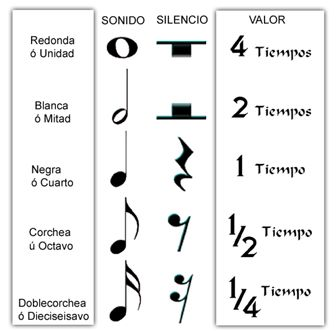

# Documentación de Seis8s
## Taller de Transferencias Aurales 2024

## Diapositivas

<iframe sandbox='allow-scripts allow-same-origin allow-presentation' allowfullscreen='true' allowtransparency='true' frameborder='0' height='315' src='https://www.mentimeter.com/app/presentation/n/bl3sqjhxztxw5vahh471djmgkj5xr19r/embed' style='position: absolute; top: 0; left: 0; width: 100%; height: 100%;' width='420'></iframe>

## Lecturas recomendadas

- La cumbia como matriz sonora de Latinoamérica: los colombias de Monterrey-México, 1960-2008, interculturalidad, identidad, espacio y cuerpo: [https://repositorio.colmex.mx/concern/theses/kk91fk66p?locale=es](https://repositorio.colmex.mx/concern/theses/kk91fk66p?locale=es)
- La invención de la música latinoamericana: [https://fce.com.ar/tienda/arte/la-invencion-de-la-musica-latinoamericana/?srsltid=AfmBOoogMJTlc1FkT7jpPyDxYVKEtzCkHF3iiVnZ8fg-h8qlvYKIyVrI](https://fce.com.ar/tienda/arte/la-invencion-de-la-musica-latinoamericana/?srsltid=AfmBOoogMJTlc1FkT7jpPyDxYVKEtzCkHF3iiVnZ8fg-h8qlvYKIyVrI)

## Atajos con el teclado (shortcuts)

| Descripción | Atajo Windows       | Atajo Mac       | Imagen                         |
|----------------|----------------|----------------|-------------------------------|
| Ejecutar/enviar saludos | Shift + Enter | Shift + Enter |    |
| Ejecutar el código | Shift + Enter| Shift + Enter |    |
| Detener el código | Ctrl + '.' | Ctrl + '.' |    |
| Agrandar texto | Ctrl + '+' | Command + '+' |    |
| Achicar texto |Ctrl + '-' | Command + '-' |    |
| Descargar documento  |Ctrl + s | Command + s |    |
| Abrir documento |Ctrl + o | Command + o |    |

## Codigos de ejemplo

Consulta códigos de ejemplo en el siguiente link: [https://luisnavarrodelangel.github.io/ejemplos-seis8s/ejemplos](https://luisnavarrodelangel.github.io/ejemplos-seis8s/ejemplos)

## Comandos globales

- Los siguientes comandos controlan los instrumentos y la composición globalmente:

| Comando |Descripción| Ejemplo
|----------------|----------------|----------------|
| `\\` | Permite escribir un comentario de una línea | `\\ este es un comantario`|
| `\* *\` | Permite escribir un comentario de varias lineas | `\* este es un comantario que puede ser de varias lineas *\`|
| `tempo` | Establece la velocidad de la música |`tempo 80;`|
| `paneo` | Mueve el sonido a la izquierda, derecha o en medio |`paneo 0;`|
| `volumen` | Establece el volumen maestro/general de la música |`volumen 0.85;`|
| `armonia` | Establece los acordes de los instrumentos |`armonia |C||Dm|;`|
| `acordes` | Es un comando sinónimo del comando armonia|`acordes |C||Dm|;`|

- La siguiente tabla muestra los acordes disponibles en Seis8s:

| Comando | Acorde |
|----------------|----------------|
| M  | mayor |
| maj  | mayor |
| maj7  | mayor siete |
| m | menor |
| min  | menor |
| min7  | menor siete |
| dim | disminuido|
|m7b5| semi disminuido|
| aug | aumentado|
| sus2 | suspendido dos|
| sus4 | suspendido cuatro|

## Comandos de los instrumentos

- Los siguientes comandos controlan los instrumentos individualmente:

### Comandos de notación musical

- La siguiente tabla muestra las figuras rítmicas de los instrumentos en Seis8s:

- Abajo se muestran los mandos para generar las figuras rítmicas de la tabla anterior:

| Comando | Figura rítmica | Valor
|----------------|----------------|----------------|
| `1n` | 𝅝 | 4 tiempos|
| `1s` | 𝄻 | 4 tiempos|
| `2n` |𝅗𝅥  | 2 tiempos|
| `2s` |𝄼  |2 tiempos|
| `4n` | 𝅘𝅥 |1 tiempo|
| `4s` | 𝄽 |1 tiempo|
| `8n` | 𝅘𝅥𝅮  | 1/2 tiempo|
| `8n` | 𝄾  |1/2 tiempo|
| `16n` | 𝅘𝅥𝅯 | 1/4 tiempo|
| `16s` | 𝄿  | 1/4 tiempo|

### Comandos del bajo

| Comando |Descripción| Ejemplo
|----------------|----------------|----------------|
| `bajo` | Toca un bajo default |`bajo;`|
| `sonido` | Cambia el sample o muestra  |`bajo (sonido 6);`|
| `volumen` | Cambia el volumen  |`bajo (volumen 0.85);`|
| `paneo` | Mueve el instrumento a la izquierda, derecha o centro  |`bajo (paneo 0.5);`|
| `octava` | Hace el instrumento más grave o agudo  |`bajo (octava 6);`|
| `tumbao` | Estable la línea melódica y rítmica del instrumento  | `bajo (tumbao | 𝅘𝅥  𝄽  𝅘𝅥 /3 𝅘𝅥 /5 || 𝅘𝅥  𝄽  𝅘𝅥 /3 𝅘𝅥 /5 |);`|

### Comandos del teclado

| Comando |Descripción| Ejemplo
|----------------|----------------|----------------|
| `teclado` | Toca un teclado default |`teclado;`|
| `sonido` | Cambia el sample o muestra  |`teclado (sonido 7);`|
| `volumen` | Cambia el volumen  |`teclado (volumen 0.95);`|
| `paneo` | Mueve el instrumento a la izquierda, derecha o centro  |`teclado (paneo 0);`|
| `octava` | Hace el instrumento más grave o agudo  |`teclado (octava 4);`|
| `acompañamiento` | Estable la línea melódica y rítmica del instrumento  |`teclado (acompañamiento | 𝄽  𝅘𝅥  𝄽  𝅘𝅥|| 𝄽  𝅘𝅥  𝄽  𝅘𝅥 |);`|
| `acompanamiento` | Sínonimo de  `acompañamiento` | `teclado (acompanamiento | 𝄽  𝅘𝅥  𝄽  𝅘𝅥 || 𝄽  𝅘𝅥  𝄽  𝅘𝅥 |);`|

### Comandos de las congas

| Comando |Descripción| Ejemplo
|----------------|----------------|----------------|
| `congas` | Toca unas congas default |`congas;`|
| `sonido` | Cambia el sample o muestra  |`congas (sonido 1);`|
| `volumen` | Cambia el volumen  |`congas (volumen 0.95);`|
| `paneo` | Mueve el instrumento a la izquierda, derecha o centro  |`congas (paneo 1);`|
| `octava` | Hace el instrumento más grave o agudo  |`congas (octava 4);`|
| `marcha` | Estable la el ritmo del instrumento  | `congas (marcha |𝄽 𝅘𝅥 𝄽 𝅘𝅥 |);`|
| `a` | Accesa el golpe abierto  | `congas (marcha |  𝄽 𝅘𝅥/a 𝄽 𝅘𝅥/a |);`|
| `s` | Accesa el golpe slap  | `congas (marcha |  𝄽 𝅘𝅥/s 𝄽 𝅘𝅥/s |);`|
| `m` | Accesa el golpe muteado   | `congas (marcha |  𝄽 𝅘𝅥/m 𝄽 𝅘𝅥/m |);`|
| `t` | Accesa el golpe con el talon de la mano/palma   | `congas (marcha |  𝄽 𝅘𝅥/t 𝄽 𝅘𝅥/t |);`|
| `p` | Accesa el golpe con la punta de la mano/palma  | `congas (marcha |  𝄽 𝅘𝅥/p 𝄽 𝅘𝅥/p |);`|

### Comandos de bombo

| Comando |Descripción| Ejemplo
|----------------|----------------|----------------|
| `bombo` | Toca un bombo default |`bombo;`|
| `sonido` | Cambia el sample o muestra  |`bombo (sonido 1);`|
| `volumen` | Cambia el volumen  |`bombo (volumen 0.95);`|
| `paneo` | Mueve el instrumento a la izquierda, derecha o centro  |`bombo (paneo 1);`|
| `octava` | Hace el instrumento más grave o agudo  |`bombo (octava 4);`|
| `ritmo` | Estable la el rítmo del instrumento  | `bombo (ritmo |𝅘𝅥  𝄽 𝅘𝅥 𝅘𝅥 |);`|

### Comandos del contratiempo

| Comando |Descripción| Ejemplo
|----------------|----------------|----------------|
| `contratiempo` | Toca un contratiempo default |`contratiempo;`|
| `contratiempos` | Sínonimo de  `contratiempo` |`contratiempos;`|
| `contras` | Sínonimo de  `contratiempo` |`contras;`|
| `sonido` | Cambia el sample o muestra  |`contratiempo (sonido 1);`|
| `volumen` | Cambia el volumen  |`contratiempo (volumen 0.95);`|
| `paneo` | Mueve el instrumento a la izquierda, derecha o centro  |`contratiempo (paneo 1);`|
| `octava` | Hace el instrumento más grave o agudo  |`contratiempo (octava 4);`|
| `ritmo` | Estable la el rítmo del instrumento  | `contratiempo ( v 0.9, ritmo |𝅘𝅥 𝅘𝅥𝅮 𝅘𝅥𝅮 𝅘𝅥 𝅘𝅥𝅮 𝅘𝅥𝅮|);`|
